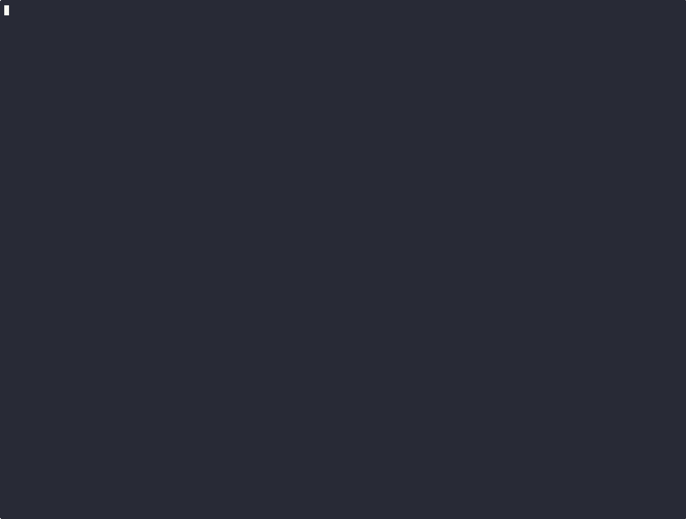

# shellbale
- By: ahost.win

A lightweight quick and dirty tool to generate shell scripts that can recreate directory structures. 
It creates human-readable shell scripts that preserve both the content and structure of directories.
Just an easily editable/portabe option to get over the boilerplate and put files into hard to reach places.

## Features

- **Low Dependencies**: Uses only standard Go libraries
- **Human-Readable Output**: Generated scripts are easy to read and understand
- **File Handling**:
  - Text files are preserved using escaped heredoc strings
  - Binary files are encoded in base64 with SHA256 hash verification
  - Empty files are handled efficiently
  - File permissions are preserved
- **Unix Philosophy**: Supports both file output and stdout for pipeline operations
- **Flexible Usage**: Can be used for backup, deployment, or configuration management
- **Testing**: For more info regarding file support see "./test/create__example_folder.sh"


### Caveats
- links aren't preserved
- large files don't work very well

### Todo
- [] binary mode to make viewing and patching many hex files easy
- [] option to use tar.gz file as a container (preserve links and other things)
- [] option to make an additional layer of script to contain the main script so that the first execution doesn't extract the directory, only place a self extracting file ready to execute manually (useful when wanting more control over pasting)
- [] option to silence more output (can make output faster)
- [] option to check the folder size before running (it doesn't check, you will probably have trouble with large folders)


## Installation

### Static binary
```bash

sudo touch /usr/local/bin/shellbale
sudo chmod +x /usr/local/bin/shellbale
# Linux
sudo wget -O /usr/local/bin/shellbale https://gitpub.ahost.win/ahost/shellbale/releases/download/v0.0.3/shellbale-linux-x86_64

# All links
sudo wget -O /usr/local/bin/shellbale https://gitpub.ahost.win/ahost/shellbale/releases/download/v0.0.3/shellbale-linux-arm64
sudo wget -O /usr/local/bin/shellbale https://gitpub.ahost.win/ahost/shellbale/releases/download/v0.0.3/shellbale-linux-x86_64
sudo wget -O /usr/local/bin/shellbale https://gitpub.ahost.win/ahost/shellbale/releases/download/v0.0.3/shellbale-mac-arm64
sudo wget -O /usr/local/bin/shellbale https://gitpub.ahost.win/ahost/shellbale/releases/download/v0.0.3/shellbale-mac-x86_64
# Windows
Invoke-WebRequest -Outfile "shellbale.exe" -Uri https://gitpub.ahost.win/ahost/shellbale/releases/download/v0.0.3/shellbale-win-x86_64.exe
Unblock-File "shellbale.exe"
```

### From Source

```bash
# Clone the repository
git clone https://gitpub.ahost.win/ahost/shellbale.git
cd shellbale

# Build for all platforms
./build.sh

# or simply build for your own platform
cd src
go build

# Optional: Install to system (requires root)
sudo cp dist/shellbale /usr/local/bin/
sudo cp src/shellbale.1 /usr/share/man/man1/
```

## Usage

Basic usage pattern:
```bash
shellbale -i INPUT_DIR [-o OUTPUT_SCRIPT]
```

### Examples

1. Create a backup script for a folder:
```bash
shellbale -t -i ./my_project -o backup_project.sh
shellbale -t -i ./my_project > backup_project.sh
```

2. Generate and pipe directly to clipboard (then paste into terminal and hit enter to execute):
```bash
shellbale -t -i ~/.config | xclip -sel clip #(Linux: apt install xclip)
shellbale -t -i ~/.config | pbcopy #(Mac)
shellbale -t -i ~/.config | clip #(Windows)
shellbale -t -i ~/.config > /dev/clipboard #(Cygwin)
```

3. Refactor/patch/rename files and contents:
```bash
shellbale -i /etc -t | sed 's/hostname_keywordtag_1234/exmaplehostname/g' > provision_etc.sh
pushd $(mktemp -d) && exec $(shellbale -i $(pwd)/../app -t | -E 's/\bExample\b/Changed/g; s/\bexample\b/changed/g; s/\bEXAMPLE\b/CHANGED/g')
```

4. Generate and pipe directly to a remote host:
```bash
shellbale -i ./deployment | ssh remote_host "cat > deploy.sh"
```


### Command Line Options

- `-h, --help`: Show help message
- `-v, --version`: Show program version
- `-i, --input DIR`: Input directory to process
- `-o, --output FILE`: Output script path (optional, defaults to stdout)
- `-t, --tree`: Include ASCII tree representation (optional flag)

## How It Works

1. **Directory Structure**: The program walks through the input directory and generates commands to recreate the directory structure.

2. **File Processing**:
   - Directories are created using `mkdir -p`
   - Empty files are created using `touch`
   - Text files are embedded using escaped heredoc strings
   - Binary files are encoded in base64 with SHA256 hash verification

3. **File Types**:
   - Text files are detected by analyzing their content
   - Binary files are identified by the presence of null bytes or high concentration of non-printable characters
   - File permissions are preserved using `chmod`

## Generated Script Format

The generated shell scripts follow this pattern:

```bash
#!/bin/sh
# built using shellbale version X.Y.Z

# Create directory structure
mkdir -p "path/to/dir"

# Handle text file
FILEPATH="path/to/file.txt"
touch "$FILEPATH"
chmod +x "$FILEPATH"  # if executable
cat <<\__EOF_TXT_1234567890 > "$FILEPATH"
... file contents ...

__EOF_TXT_1234567890

# Handle binary file
FILEPATH="path/to/file.bin"
touch "$FILEPATH"
EXPECTED_HASH=... # SHA256 hash
cat <<'__EOF_BIN_1234567890' | base64 -d > "$FILEPATH"
... base64 encoded content ...

__EOF_BIN_1234567890
# Verify hash
COMPUTED_HASH=$(sha256sum "$FILEPATH" | cut -d' ' -f1)
if [ "$COMPUTED_HASH" = "$EXPECTED_HASH" ]; then
    : # Hash matches
else
    echo "Hash does not match for $FILEPATH!"
    exit 1
fi
```


## Alternative, just some lines of sh (with fewer features and checking)
- If all you need is to copy a directory using a clipboard
- if you just want the text, remove "|xclip -sel clip" 

```bash
#/bin/sh
# tar.sh <FOLDERPATH>
FOLDERPATH=$1
cat <<__EOF_TAR_DOT_SH | xclip -sel clip
cat <<\__TX_EOF_TAR_DO_SH | base64 -d | tar -xf -
$(tar -cf - "$FOLDERPATH" | base64 -w0)
__TX_EOF_TAR_DO_SH
__EOF_TAR_DOT_SH

```

## Contributing

Contributions are welcome! Please feel free to submit a Pull Request.

## License

This project is licensed under the GNU Lesser General Public License v3.0 - see the [LICENSE](LICENSE) file for details.
[![LGPL v3](data:image/svg+xml;base64,PHN2ZyB4bWxucz0iaHR0cDovL3d3dy53My5vcmcvMjAwMC9zdmciIHdpZHRoPSIxMDYiIGhlaWdodD0iMjAiIHJvbGU9ImltZyIgYXJpYS1sYWJlbD0iTGljZW5zZTogTEdQTCB2MyI+PHRpdGxlPkxpY2Vuc2U6IExHUEwgdjM8L3RpdGxlPjxsaW5lYXJHcmFkaWVudCBpZD0icyIgeDI9IjAiIHkyPSIxMDAlIj48c3RvcCBvZmZzZXQ9IjAiIHN0b3AtY29sb3I9IiNiYmIiIHN0b3Atb3BhY2l0eT0iLjEiLz48c3RvcCBvZmZzZXQ9IjEiIHN0b3Atb3BhY2l0eT0iLjEiLz48L2xpbmVhckdyYWRpZW50PjxjbGlwUGF0aCBpZD0iciI+PHJlY3Qgd2lkdGg9IjEwNiIgaGVpZ2h0PSIyMCIgcng9IjMiIGZpbGw9IiNmZmYiLz48L2NsaXBQYXRoPjxnIGNsaXAtcGF0aD0idXJsKCNyKSI+PHJlY3Qgd2lkdGg9IjUxIiBoZWlnaHQ9IjIwIiBmaWxsPSIjNTU1Ii8+PHJlY3QgeD0iNTEiIHdpZHRoPSI1NSIgaGVpZ2h0PSIyMCIgZmlsbD0iIzAwN2VjNiIvPjxyZWN0IHdpZHRoPSIxMDYiIGhlaWdodD0iMjAiIGZpbGw9InVybCgjcykiLz48L2c+PGcgZmlsbD0iI2ZmZiIgdGV4dC1hbmNob3I9Im1pZGRsZSIgZm9udC1mYW1pbHk9IlZlcmRhbmEsR2VuZXZhLERlamFWdSBTYW5zLHNhbnMtc2VyaWYiIHRleHQtcmVuZGVyaW5nPSJnZW9tZXRyaWNQcmVjaXNpb24iIGZvbnQtc2l6ZT0iMTEwIj48dGV4dCBhcmlhLWhpZGRlbj0idHJ1ZSIgeD0iMjY1IiB5PSIxNTAiIGZpbGw9IiMwMTAxMDEiIGZpbGwtb3BhY2l0eT0iLjMiIHRyYW5zZm9ybT0ic2NhbGUoLjEpIiB0ZXh0TGVuZ3RoPSI0MTAiPkxpY2Vuc2U8L3RleHQ+PHRleHQgeD0iMjY1IiB5PSIxNDAiIHRyYW5zZm9ybT0ic2NhbGUoLjEpIiBmaWxsPSIjZmZmIiB0ZXh0TGVuZ3RoPSI0MTAiPkxpY2Vuc2U8L3RleHQ+PHRleHQgYXJpYS1oaWRkZW49InRydWUiIHg9Ijc3NSIgeT0iMTUwIiBmaWxsPSIjMDEwMTAxIiBmaWxsLW9wYWNpdHk9Ii4zIiB0cmFuc2Zvcm09InNjYWxlKC4xKSIgdGV4dExlbmd0aD0iNDUwIj5MR1BMIHYzPC90ZXh0Pjx0ZXh0IHg9Ijc3NSIgeT0iMTQwIiB0cmFuc2Zvcm09InNjYWxlKC4xKSIgZmlsbD0iI2ZmZiIgdGV4dExlbmd0aD0iNDUwIj5MR1BMIHYzPC90ZXh0PjwvZz48L3N2Zz4=)](https://www.gnu.org/licenses/lgpl-3.0)
